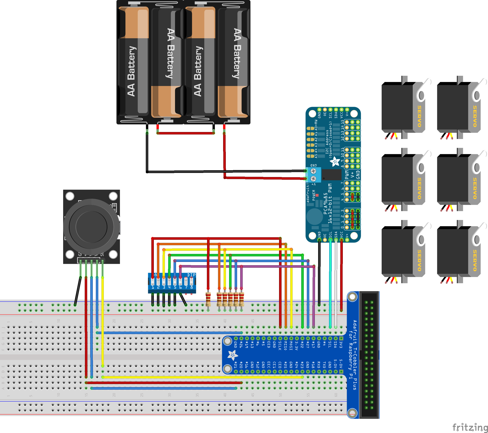
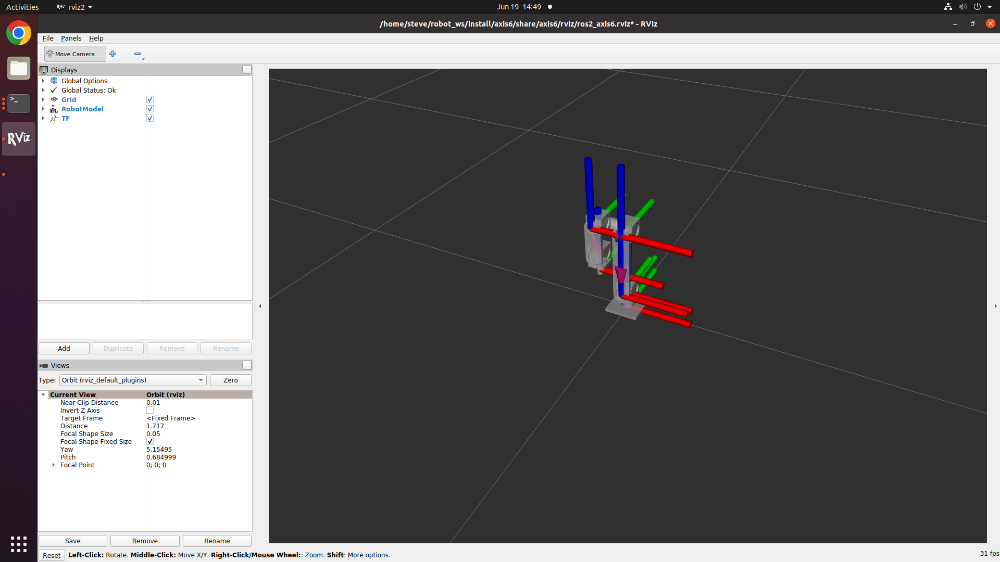

# axis6

An ros2 package that uses an odroid to control the six-axis robot arm.

## Intro


### requirements

#### hardware

- Odroid board x1 (N2, C4, M1 ..)
- [robot frame](https://www.aliexpress.com/item/32858303546.html?pdp_npi=2%40dis%21KRW%21%E2%82%A9%2042%2C155%21%E2%82%A9%2040%2C463%21%21%21%21%21%402103010b16824857878262784e96d2%2165326785008%21btf&_t=pvid%3Ad28f4b46-8eff-49f3-b543-134dce62b94c&afTraceInfo=32858303546__pc__pcBridgePPC__xxxxxx__1682485788&spm=a2g0o.ppclist.product.mainProduct&gatewayAdapt=glo2kor)
- [MG996R](https://www.aliexpress.com/item/1005005200022250.html?spm=a2g0o.productlist.main.1.52a93d167VwLLG&algo_pvid=a2ee8dde-5400-4bbc-8e5b-eff5a24176d7&aem_p4p_detail=202304252211317561106546918600023300123&algo_exp_id=a2ee8dde-5400-4bbc-8e5b-eff5a24176d7-0&pdp_npi=3%40dis%21KRW%214979.0%214731.0%21%21%21%21%21%40211bc2a016824858919401497d075e%2112000032121202928%21sea%21KR%210&curPageLogUid=I8jXdGUt85Q1&ad_pvid=202304252211317561106546918600023300123_1&ad_pvid=202304252211317561106546918600023300123_1) x 6
- pca9685: [How to Use](https://www.how2flow.net/posts/pca9685)
- dip-switch (>= 6)
- joystick module (KY-023)
- resister (>= 1k) x 6

#### develop env

(You must have a separate desktop to use rviz.)

- kernel 5.15.y (flash odroid ros2 image) [N2+](https://dn.odroid.com/S922X/ODROID-N2/ROS2/ubuntu-20.04-ros2-odroidn2plus-20230105.img.xz) / [N2L](https://dn.odroid.com/S922X/ODROID-N2L/ROS2/ubuntu-20.04-ros2-odroidn2l-20230104.img.xz) / [C4](https://dn.odroid.com/S905X3/ODROID-C4/ROS2/ubuntu-20.04-ros2-odroidc4-20230105.img.xz) / [M1](https://dn.odroid.com/RK3568/ODROID-M1/ROS2/ubuntu-20.04-ros2-npu-odroidm1-20230104.img.xz)
- ros2-foxy
- libgpiod (odroid only)
- adafruit-circuitpython-pca9685 (odroid only)
- odroid-wiringpi (odroid only)

### circuit



### fixups

This is the process since you installed ros2. (odroid only)<br>
<br>

Install pip packages
```
$ sudo python3 -m pip install --upgrade pip
$ sudo python3 -m pip install adafruit-circuitpython-pca9685 \
  adafruit-python-shell click wheel \
  Adafruit-Blinka==8.18.1 \
  adafruit-circuitpython-register \
  adafruit-circuitpython-busdevice
```
<br>

Install libgpiod.py
```
$ wget https://raw.githubusercontent.com/adafruit/Raspberry-Pi-Installer-Scripts/master/libgpiod.py
$ sudo python3 libgpiod.py # ignore errors
```
<br>

Install libgpiod library
```
$ git clone https://git.kernel.org/pub/scm/libs/libgpiod/libgpiod.git
$ cd libgpiod
$ git checkout v1.4.2 -b v1.4.2
$ sudo ./autogen.sh --enable-tools=yes --prefix=/usr/local/ --enable-bindings-python CFLAGS="-I/$include_path"
$ sudo make
$ sudo ldconfig
$ sudo cp bindings/python/.libs/gpiod.* /usr/local/lib/python3.?/dist-packages
```
<br>

Each board has a different installation method for the odroid-wirigpi APT package<br>
<br>

Install odroid-wiringpi (N2/N2L/C4)
```
$ sudo apt install software-properties-common
$ sudo add-apt-repository ppa:hardkernel/ppa
$ sudo apt update
$ sudo apt install odroid-wiringpi
```
<br>

Install odroid-wiringpi (M1)
```
$ sudo apt update
$ sudo apt install odroid-wiringpi
```
<br>

After install odroid-wiringpi APT package,<br>
Install odroid-wiringpi pip package.<br>

Install odroid-wiringpi:pip
```
$ python3 -m pip install odroid-wiringpi
```
<br>

### Usage

There are three modes of this package.<br>

If you want to use all three, you can use one desktop with ros2 installed<br>
and one odroid board with ros2 and all requirements installed.<br>

1. `Normal mode`:<br>
robot control with joystick.<br>
it is default.<br>
Select(dip-switch) the motor(only one) you want to control, then control it with the joystick.<br>
If you turn off all dip switches, you become neutral.<br>
When changing the motor to be controlled, leave it in neutral, and then select the one channel.<br>
It was in a different mode, to switch to normal mode,<br>
turn off all dip switches to make them neutral, and then press the joystick.<br>

2. `Display mode`:<br>
When all the dip switches are turned off and push joystick, the display mode is turned on. It can be controlled by rviz2.<br>
To switch to normal mode, turn off all dip switches to make them neutral, and then press the joystick.<br>

3. `Service mode`:<br>
When the service is called through the 'commander' node, it enters the service mode.<br>
To switch to a different mode, as I just mentioned, you can either turn off or turn on all of the dip switches and push the joystick.<br>

#### Usage: build
How to Build:
```
$ sudo groupadd gpiod --gid {group_id}
$ sudo usermod -aG gpiod $(whoami)
$ git clone --recurse-submodules https://github.com/how2flow/ros2_axis6.git
$ cd ros2_axis6
$ ./preinstall.sh
$ reboot
```
```
$ mkdir -p robot_ws/src
$ ln -s ~/ros2_axis6 robot_ws/src
$ ln -s ~/ros2_axis6/how2flow_interfaces ~/robot_ws/src
$ cd ~/robot_ws && colcon build --symlink-install
```
<br>

#### Usage: run
How to Run:

Node 1. commander
```
$ ros2 run axis6 commander
```

Node 2. operator (odroid)
```
$ ros2 run axis6 operator
```
<br>

#### Usage: display

View and Contorl prototype in rviz.<br>
Not available on the odroid board.<br>

requirements: ros-foxy-joint-state-publisher-gui
```
$ ros2 launch display.prototype.py
```


<br>
if you want to control with rviz2,<br>
All dip-switch on and push joystick<br>

### youtube

[](https://youtu.be/CugwPAGal3o)
